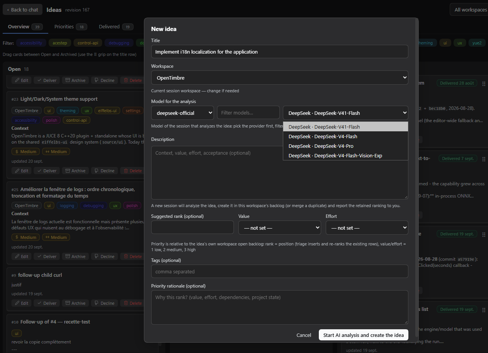

# dsh-plugin-ideas-manager

**The Ideas manager** brings an idea backlog straight into the DSH Web GUI. It's
a generic, self-contained backlog: an AI agent captures ideas, each one
becomes a card on a kanban, gets scored and ranked, and flows through a
lifecycle until it's delivered or declined. It also bridges to the
[TaskBoard plugin](#taskboard-integration)
([`@linxin666/dsh-client-ui-task-board`](https://www.npmjs.com/package/@linxin666/dsh-client-ui-task-board),
by linxin666 — third-party, not affiliated) when present.

A Host-authoritative `/api/ideas` ledger keeps everything consistent and lets
an agent write cards directly over HTTP — no UI needed. Fully usable without
TaskBoard: **zero hard dependency** on it.



---

## What it does for you

### Capture ideas, anywhere
- A **sidebar entry** (New Session → **Ideas**) opens the panel.
- **Capture** an idea with the *New idea* button or the **quick-add** row at the
  top of the Open column — a Title is the only required field.
- Optional description (markdown), **tags**, workspace and a **Suggested rank**.
- The **AI capture** button opens a fresh session that analyzes the draft,
  creates/merges the idea in the backlog, and reports the retained ranking.

### A 4-column kanban
Open · Under review · Archived · Declined.
- **Drag & drop** moves cards between columns and reorders them; the columns
  auto-scroll when you drag toward an edge (vertically and horizontally when
  Archived/Declined are off-screen on a narrow window).
- **Search** and a **conjunctive tag filter** narrow the columns. Cards
  render a short **body excerpt** (idea #34): the full analysis is fetched
  on demand when the edit modal, follow-up composer or re-analyze opens, and
  the first active search loads a deep index once so whole-body matches keep
  working.
- Single click on a card title or description opens the **edit modal** (raw
  text or rendered markdown of the full body).
- Every card shows its stable **`#N` number**, **workspace chip**, **tags**,
  **value/effort badges** and update date.

### Scoring & ranking
- Each idea carries **Value** and **Effort** (low / medium / high), shown as
  color-coded badges.
- The **Suggested rank** is the position in the *open backlog of its workspace*;
  entering one re-ranks the backlog transactionally (existing rows shift).
- A dedicated **Priorities** tab ranks the open ideas per workspace, with
  ↑/↓ buttons and drag & drop to re-rank.

### The lifecycle
- **Deliver** ✓ archives the idea with a green *Delivered {date}* stamp.
- **Under review** is the *recette* gate: finished work lands there, and each
  card offers **Recette OK** (deliver), **Follow-up needed** (creates a linked
  open child plus justification, archives the parent) and **Decline**.
- **Delivered** tab shows the exit log (delivered vs. manually archived).
- Restore, archive and delete are one click away on each card.

### Workspaces
- A header selector scopes the board to one workspace (or *all* / *none*).
- New ideas default to the **current session's workspace** when not scoped.
- The New/Edit modal carries a workspace field so a capture lands in the right
  place and an idea can be moved to another workspace.

---

## Settings

The plugin contributes an **Ideas board** section to the DSH Settings modal.
Options are read and written through the plugin's own fenced
`GET/POST /api/ideas/config` route — the DSH settings RPC domain does not serve
third-party namespaces — and the backing store follows the host generation,
detected at runtime:

- **Host <= 0.1.5**: a registered `ideas` settings namespace (schemastery
  schema, `applies: 'live'`, revision-fenced writes persisted in the profile's
  settings document) — the historical behaviour, unchanged.
- **Host >= 0.1.7**: the SettingsForms refactor removed `ctx.settings.register`,
  so the plugin keeps its options in its own versioned document,
  `<DSH_HOME>/ideas-manager-settings.json`, behind the same incrementing
  revision fence (an unreadable document is quarantined beside itself — renamed,
  never deleted — and the defaults take over).

Both hosts answer the identical wire contract (a complete sanitized value plus
its revision; a stale write is refused with `409 settings-conflict`), so the
section behaves the same everywhere. Every option ships with an explicit title
and a description stating what it changes, its range and its default:

- **Visible tag-filter lines** (`tagRows`, 1–5, default 3): how many rows of
  tags the board shows under the tabs before the zone scrolls; the sticky
  header (label + search + clear-filter) always stays visible. Applied
  immediately, stored per DSH profile.

Deployments without a settings service keep the spelled defaults (the section
says so) — the board never depends on the settings surface.

## TaskBoard integration

When the TaskBoard plugin
([`@linxin666/dsh-client-ui-task-board`](https://www.npmjs.com/package/@linxin666/dsh-client-ui-task-board),
repo: [zhu1090093659/dsh-web](https://github.com/zhu1090093659/dsh-web)) is
present, the Ideas manager mirrors its ledger onto TaskBoard's `backlog` so
both tools stay in sync — **one-way** (Ideas → TaskBoard).
The mirror is detected at runtime (`GET /api/task-board/state`); if TaskBoard is
absent the Ideas manager simply works standalone.

| Ideas action | TaskBoard mirror |
|---|---|
| Create idea | New read-only card in `backlog` (bound to the idea id) |
| Update idea | Card updated |
| Decline / drag to Archived | Card archived |
| Restore | Card restored |
| Delete | No-op (closing to `done` stays manual) |
| **Task-Board card reaches `done`** | Idea auto-moves to **Under review** (the recette gate) |

Triage (scores, rationale, rank) is **ideas-only** and is never mirrored — it's a
backlog opinion, not a board state.

Card weight: the card `description` carries the idea's `summary` (<= 300
chars, produced by the ideas-analyst; a derived body excerpt otherwise) while
the full analysis rides the card `prompt` (the run instruction) and the ledger
— the body is never stored twice in the snapshot.

### Duplicate guard (exactly one card per idea)

Card ids are **deterministic** (`idea-` + the idea id), so re-running any
mirror path re-touches the same card instead of minting a twin. A bound idea's
card is only rebuilt when a *non-empty* task-board snapshot proves it was
deleted out-of-band — every `ensureTask` decision (idea id, binding, snapshot
size, branch) is logged, and an empty or unreadable snapshot keeps the binding
and attempts the patch, never a create. Mirror operations are serialized per
idea id, so a create always completes (and binds) before a following update
runs — "update" can never silently mean "create".

Two scripts close the loop:

- `node scripts/reconcile-taskboard-mirror.mjs [--url …] [--apply]` — detects
  orphan duplicates (unbound card whose exact title matches a bound idea) and
  archives them, always keeping the bound card; dry-run by default.
- `node scripts/validate-mirror-cycle.mjs [--base …]` — live recette against a
  test instance: create → re-analyze → analyst rewrite → decline must end with
  exactly one card.

> **Note for agent-driven workflows:** the capture → triage → lifecycle
> protocol and the full wire contract are documented in
> [`SKILL.md`](SKILL.md), so an agent can author cards directly over the HTTP
> API without the UI.

---

## Host API (agents)

The Host exposes a REST API so scripts and agents can read the board and write
ideas. Prefix `/api/ideas`, same-origin fence (loopback socket + browser
markers), JSON envelopes `{ requestId, action, initiator? }`.

| Route | Purpose |
|---|---|
| `GET /api/ideas/state` | `{ schemaVersion: 1, revision, ideas[] }` |
| `POST /api/ideas/action` | `create`, `update`, `move`, `decline`, `deliver`, `followUp`, `triage`, `restore`, `delete`, `reanalyze`, `reorder`, `import`, `export` |
| `GET /api/ideas/events` | SSE `{ revision }` |

Every action is **deduplicated by `requestId`** (fresh id per call), and a
mutating action returns the whole board so the caller can confirm the result.
Full contract (verb table, mirror mapping, PowerShell gotchas) lives in
[`SKILL.md`](SKILL.md).

---

## Host compatibility

- **Requires Host >= 0.1.5** (see `dsh.engines.dsh` in `package.json`).
- **Settings section works on host 0.1.5 and 0.1.7+**: the settings service
  contract is detected at runtime (`settings.register` present = legacy `ideas`
  namespace, exactly as before; absent after the 0.1.7 SettingsForms refactor =
  plugin-owned `<DSH_HOME>/ideas-manager-settings.json`), so 0.1.7 boots with
  no `settings namespace registration failed` line and 0.1.5 keeps the exact
  0.3.3 behaviour.
- On **Host >= 0.1.7** the client retains the agent scope before prompting:
  `sessions.scope(id)` became a pure read there (a just-created session is no
  longer visible through it until its scope is retained), so the AI capture /
  re-analyze launcher first calls `retainAgentScope(id)` — which materializes
  the scope — takes the context from the reference's `binding.ctx`, prompts,
  and always releases the retention (success, prompt rejection or missing
  session face).
- On **Host <= 0.1.5** the method does not exist and the launcher keeps the
  exact previous call sequence (`scope(id)` materializes the scope on demand).

---

## Install & update

From npm (recommended):

```sh
dsh plugin --profile web add dsh-plugin-ideas-manager
```

Pinned to a version:

```sh
dsh plugin --profile web add dsh-plugin-ideas-manager@0.3.4
```

From a local checkout (no registry needed):

```sh
dsh plugin --profile web add link:/path/to/dsh-plugin-ideas-manager
```

From a git URL (fallback, pinned to a released tag):

```sh
dsh plugin --profile web add github:EiffelBS/dsh-plugin-ideas-manager#v0.3.4
```

`dsh plugin` runs `pnpm add` in the profile directory, then reconciles
`dsh.profile.bundles`: because this package declares a `dsh.bundle`, it is
auto-appended as a profile layer. Restart the web instance (or open a fresh
page session) for the bundle change to take effect.

Verify installation:

```sh
dsh web --profile web --no-open   # then look for the Ideas entry in the sidebar
```

To pick up a newer revision after a release (versions follow the package's
`version` field; releases are tagged, e.g. `v0.3.4`):

```sh
dsh plugin --profile web add dsh-plugin-ideas-manager@latest
```

then restart the web instance.

Uninstall / disable:

```sh
dsh plugin --profile web remove dsh-plugin-ideas-manager
```

> **Maintainers:** bump `version` in `package.json` on each meaningful push so
> an installed profile's version stays observable (e.g. via `dsh plugin ls` or
> `pnpm list` in the profile directory).

---

## Build, test & install (dev)

```powershell
pnpm run typecheck   # tsc --noEmit
pnpm test            # vitest (protocol gate, ledger persistence, export golden, mirror, markdown parser)
pnpm run build       # tsc -p tsconfig.build.json (types -> lib/types) && tsdown (lib/index.js + lib/client.js)

# isolated test profile (never the production profile of a live instance)
dsh --profile ideas-test --from-default-profile web --dump-config
dsh plugin --profile ideas-test add link:C:/path/to/dsh-plugin-ideas-manager
dsh --profile ideas-test --port 3099                # omitting --no-open opens the browser with the token URL
```

The browser half is served at `/plugins/<id>/client.js` (re-resolved per
request); the host half registers the `/api/ideas` routes at boot.

## Architecture

```
src/
  index.ts            # apply + mountOnce + Config + guidance section
  protocol.ts         # /api/ideas prefix, types, parseActionEnvelope (exactKeys)
  host-service.ts     # apply + mirror scheduling
  host-ledger.ts      # persisted ledger, dedupe cache, lock, internal bind
  host-routes.ts      # state (+ ?view=list projection) / idea?id= / action / events + loopback guard
  taskboard-bridge.ts # runtime feature-detect + one-way mirror (no hard import)
  export-markdown.ts  # unidirectional ledger -> markdown (golden-tested)
  http.ts / loopback.ts / mount-once.ts   # shared discipline
  core/ideas.ts       # IdeaRecord, statuses, tag validation
  client/             # sidebar entry + kanban + Priorities/Delivered + workspace scoping
tests/                # vitest suites per module
  SKILL.md / README.md
```

Persistence lives in `~/.dsh/ideas/ledger-v2.json` (atomic tmp+rename writes,
corruption quarantine, single-writer lock, restart-safe request-id dedupe).

High-card-load evaluation (before/after numbers, deferred-vs-priority
decision): see `docs/perf-evaluation.md`; live profiler:
`scripts/perf-live.mjs` (test instance only).

## License

MIT — see `LICENSE`.
