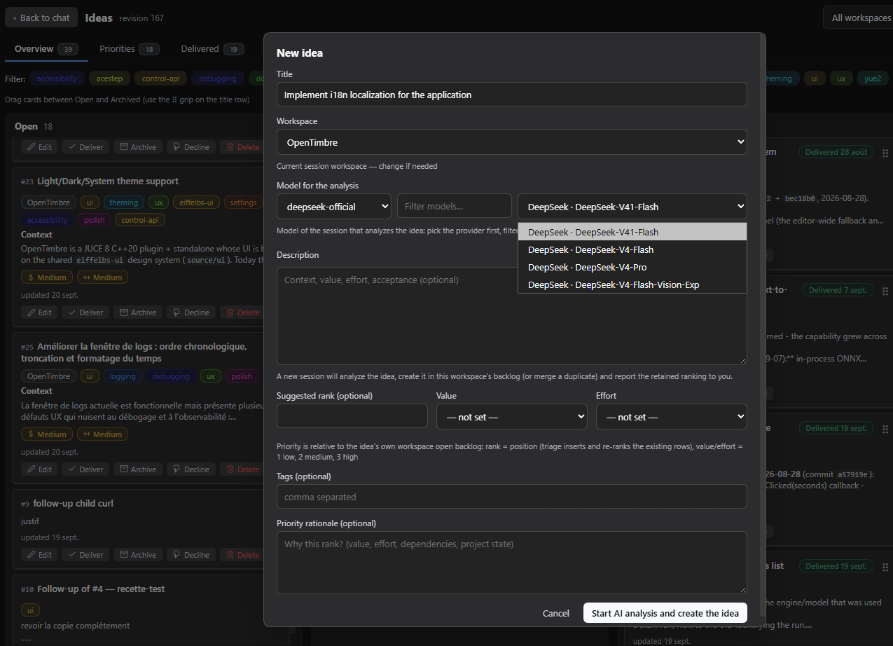

# dsh-plugin-ideas-manager

**The Ideas manager** brings an idea backlog straight into the DSH Web GUI. It's
a generic, self-contained backlog: an AI agent captures ideas, each one becomes a
card on a kanban, gets scored and ranked, flows through a lifecycle, and can be
**run as a real execution** with one click. It also bridges to the
[TaskBoard plugin](#taskboard-integration)
([`@linxin666/dsh-client-ui-task-board`](https://www.npmjs.com/package/@linxin666/dsh-client-ui-task-board),
by linxin666 — third-party, not affiliated) when present.

A Host-authoritative `/api/ideas` ledger keeps everything consistent and lets an
agent write cards directly over HTTP — no UI needed. Fully usable without
TaskBoard: **zero hard dependency** on it.



---

## What it does for you

### Capture ideas, anywhere
- A **panel row** beside Task Board and Plugins (under New Session) opens the
  board, and switching to another panel closes it like every other one.
- **Capture** an idea with the *New idea* button or the **quick-add** row at the
  top of the Open column — a Title is the only required field.
- Optional description (markdown), **tags**, workspace and a **Suggested rank**.
- The **AI capture** button opens a session that analyzes the draft,
  creates/merges the idea in the backlog, and reports the retained ranking.
- **Find similar** (on an open idea, next to *Re-analyze*) asks whether the idea
  duplicates something you already have: the board lists the open ideas of the
  same workspace whose title and tags look close, and an analyst session then
  reads their real content and rules on each one — duplicate, related but
  distinct, or unrelated. The score it shows is a rough signal the session is
  told to distrust, and the action never merges anything: it recommends, you
  decide.

### A 4-column kanban
Open · Under review · Archived · Declined.
- **Drag & drop** moves cards between columns and reorders them; the columns
  auto-scroll when you drag toward an edge.
- **Search** and a **conjunctive tag filter** narrow the whole board — all three
  tabs (Overview columns, Priorities ranking, Delivered log) share both filters.
- Click a card title or its description to open the **editor** (raw text or
  rendered markdown). It edits the whole body, fetched on demand, and is titled
  with the card number it is editing.
- Every card shows its stable **`#N` number**, **workspace chip**, **tags**,
  **value/effort badges** and update date.

### Scoring & ranking
- Each idea carries **Value** and **Effort** (low / medium / high), shown as
  color-coded badges.
- The **Suggested rank** is the position in the *open backlog of its workspace*;
  entering one re-ranks that backlog (existing rows shift).
- A dedicated **Priorities** tab ranks the open ideas per workspace, with ↑/↓
  buttons and drag & drop to re-rank.

### The lifecycle
- **Deliver** ✓ archives the idea with a green *Delivered {date}* stamp.
- **Under review** is the review gate: finished work lands there, and each card
  offers **Approve** (deliver), **Follow-up needed** (creates a linked open child
  plus a justification, archives the parent) and **Decline**.
- A **Task failed** badge marks an idea whose execution failed. It deliberately
  **stays in the backlog** — a failed run delivered nothing, so there is nothing
  to review — and you retry or adjust the idea. The badge follows the last status
  observed and clears itself when the task is retried.
- A quiet **Stale** badge marks an **open** idea nobody has updated for a while,
  on the Overview cards and in the Priorities list. Set *Stale after (days)* in
  the settings (30 by default, 0 turns it off). It is a display aid only: it is
  drawn when the board paints, nothing is written to your ideas, and it never
  appears on an idea already under review, delivered or declined.
- The **sidebar** icon carries a small amber count of how many ideas are waiting
  in **Under review**, for the current workspace scope. It reads the list the page
  already has, and vanishes when the gate is empty.
- The **Delivered** tab shows the exit log (delivered vs. manually archived).
- Restore, archive and delete are one click away on each card.

### Run an idea
An open idea that has a **workspace** and no run in flight offers a
**Launch execution** button — on the card, and in the editor. The editor matters:
it is the surface you reach from the Priorities and Delivered tabs, so you never
have to hunt the card back in the Overview to start a run.

1. Click **Launch execution**, pick a model (or keep the session default) and
   confirm. DSH tells you which of the two ways it will run before you commit.
2. **With the TaskBoard plugin installed**, the run goes through that idea's
   board card. **Without it**, DSH opens a brand-new chat session in the idea's
   workspace instead. Either way you get a real execution, and the board needs no
   extra plugin for the feature to work.
3. The run happens in the **background**: closing the tab, or restarting the web
   instance, does not lose it and DSH keeps watching it for you.
4. While it runs, the card shows a blue **Running** pill and an
   **Open session** link — one click lands you in the execution, which is the
   only way to watch a session DSH started on your behalf. The same pills now
   ride the **Priorities** and **Delivered** rows too, in the row's top-right
   corner exactly like on the card, so the "is this one already being worked
   on?" answer is available on the list you actually read, without opening the
   card.
5. When it finishes, the idea moves to **Under review** for your verdict. If it
   failed, it stays in the backlog behind the **Task failed** badge.
6. The card shows what the run **delivered**: the closing words of the run, kept
   under the description, above the verdict buttons in the editor, and on the
   row in the *Delivered* list. It is the run's own last answer, not a summary
   written for you — and when a run leaves nothing behind, the note says so
   instead of showing an empty box. **Open session** still remains the way to
   watch the whole thing; the note is the short version for deciding.

A run takes a while, and the board reflects the result within roughly half a
minute of the session finishing.

> A direct session inherits your normal DSH permissions. TaskBoard's own run
> options (such as a confirmation prompt) are not applied to it.

### An idea remembers what happened to it
Every idea keeps a short **activity log** — who did what, and when — and the
editor shows it as a compact timeline under the description, right above the
verdict buttons.

- It is written by the board itself: the capture, the rank and score changes,
  the launch, the run that finished (or failed), the approval, the follow-up,
  the decline with its reason. Entries name their author — **you**, an agent,
  or the run itself — so a month-old decision is still attributable.
- It keeps the **last 50 entries** and nothing more. An older idea simply shows
  the tail of its life, and an idea that has recorded nothing yet shows nothing
  at all rather than an empty box.
- It travels with the idea: the JSON export/import carries it, and the markdown
  export prints it as a short **Activity** block, so an archived document can
  still answer *why was this declined?*.
- It also feeds **Re-analyze**. When you ask for a fresh analysis, the analyst
  is handed what actually happened to this idea before, so it re-reads the real
  history instead of re-proposing something already refused.

### Merging duplicates
Two captures can describe the same work. When that happens, one **merge** folds
the duplicate into the idea that survives.

- The surviving card keeps its **title, its analysis and its position** in the
  backlog. A duplicate contributes only what it has that the survivor lacks:
  its **tags**, and its place in a follow-up chain — the survivor inherits that
  link, and any follow-up that hung off the duplicate now points at the
  survivor instead.
- The duplicate is **archived** with a note naming the card it was merged into,
  so the reason is still there long after the backlog moved on. Both ideas record
  it in their activity log.
- It is **one commit**: there is never a moment where both cards are open.
- **Different workspaces are refused** with a reason. Merging across projects
  would quietly move work between them, which is your call to make explicitly.
- Whether the survivor takes the duplicate's rank or keeps its own is chosen per
  merge.
- A merge **never touches a running execution or a bound task card**. If you want
  the duplicate's analysis rather than the survivor's, that is a different thing
  to ask for.

You do not have to trigger a merge by hand. The **Find similar** action finds the
candidates and asks the analyst to rule on them; the AI capture flow merges a
duplicate on its own when it judges one. Both are reversible: a merged card can be
restored from the archive like any other.

### Workspaces
- A header selector scopes the board to one workspace (or *all* / *none*).
- New ideas default to the **current session's workspace** when not scoped.
- The New/Edit modal carries a workspace field, so a capture lands in the right
  place and an idea can be moved to another workspace.

---

## Settings

The plugin contributes an **Ideas board** section to the DSH Settings modal:

- **Visible tag-filter lines** (`tagRows`, 1–5, default 3): how many rows of
  tags the board shows under the tabs before the zone scrolls. The sticky header
  (label + search + clear) always stays visible. Applied immediately, stored per
  DSH profile.
- **Interface language** (`language`, default `auto`): the panel's **own**
  language, independent of the DSH shell setting. `auto` follows the shell, and
  `en` / `fr` / `zh` pin the panel to one dictionary. Applied immediately.
  Dictionaries: English (default fallback), French, Simplified Chinese.
- **Open column order** (`openOrdering`, default `createdAt`): how the Overview's
  Open column is laid out. `createdAt` shows the oldest idea first, `createdAtDesc`
  the newest first, and `rank` the ranking you set by hand.
- **Show running ideas at the top** (`runningFirst`, on by default): floats the
  ideas whose run is in flight above whichever of the three orders is selected,
  without changing that order. A failed run keeps its red tag but stays where the
  selected order puts it.
- **Direct-launch permission** (`directRunPermission`, default
  `workspace-write`): the level granted to the fresh session when you launch an
  idea that has **no TaskBoard card**. The run brief asks for implementation, so a
  read-only session would only answer with a plan and settle the run having
  written nothing. Card-backed ideas are not affected — a mirrored card carries
  the TaskBoard's own deployment permission (never above it), so launching one
  never asks for a confirmation.
- **Stale after (days)** (`staleAfterDays`, default 30): how long an **open** idea
  may go without an update before it wears the quiet *Stale* badge on its Overview
  card and its Priorities row. `0` turns the marker off. A display setting like the
  others: applied immediately, stored per DSH profile, and nothing is written to
  the ideas themselves.

Both are a **view only** — neither stores anything, so the 2.5 s poll can never
overwrite the ranking you chose, and the move arrows in the Priorities tab still
write the rank you edit there. While either one reorders the Open column, its drag
grip is off (the position you see is not the rank you would be writing); the card
buttons still move an idea to another column, and choosing `rank` with the float
off brings the grip back. The **Priorities** tab always stays on the stored rank —
it prints a position number and its arrows write one rank step.

Deployments without a settings service keep the defaults; the board never depends
on the settings surface. Options are stored per DSH profile and never leave your
machine.

---

## TaskBoard integration

When the TaskBoard plugin
([`@linxin666/dsh-client-ui-task-board`](https://www.npmjs.com/package/@linxin666/dsh-client-ui-task-board),
repo: [zhu1090093659/dsh-web](https://github.com/zhu1090093659/dsh-web)) is
present, the Ideas manager mirrors its ledger onto TaskBoard's `backlog` so
both tools stay in sync — **one-way** (Ideas → TaskBoard). If TaskBoard is
absent, the Ideas manager simply works standalone.

| Ideas action | TaskBoard mirror |
|---|---|
| Create idea | New card in `backlog`, at the deployment's own permission (never above it) |
| Update idea | Card updated |
| Decline / drag to Archived | Card archived |
| Restore | Card restored |
| Delete | No-op (closing to `done` stays manual) |
| Launch execution | The card runs it — raised to the deployment permission first if it predates it |
| **The run reaches `done`** | Idea auto-moves to **Under review** (the review gate) |

Triage (scores, rationale, rank) is **ideas-only** and is never mirrored — it's a
backlog opinion, not a board state. After a run, the card's content is frozen, so
later edits to the idea no longer replicate to it.

---

## Host compatibility

- **Requires Host >= 0.1.5** (see `dsh.engines.dsh` in `package.json`).
- The settings section, the board and both execution backends work on current
  hosts; older combinations degrade rather than break (for example, a very old
  TaskBoard without a run action simply means runs are started as sessions, or
  no Launch button is offered at all when neither route is available).

---

## Install & update

From npm (recommended):

```sh
dsh plugin --profile web add dsh-plugin-ideas-manager
```

Pinned to a version:

```sh
dsh plugin --profile web add dsh-plugin-ideas-manager@0.7.0
```

From a local checkout (no registry needed):

```sh
dsh plugin --profile web add link:/path/to/dsh-plugin-ideas-manager
```

From a git URL (fallback, pinned to a released tag):

```sh
dsh plugin --profile web add github:EiffelBS/dsh-plugin-ideas-manager#v0.7.0
```

`dsh plugin` runs `pnpm add` in the profile directory, then reconciles
`dsh.profile.bundles`: because this package declares a `dsh.bundle`, it is
auto-appended as a profile layer. Restart the web instance (or open a fresh page
session) for the bundle change to take effect.

Verify installation:

```sh
dsh web --profile web --no-open   # then look for the Ideas entry in the sidebar
```

To pick up a newer revision after a release:

```sh
dsh plugin --profile web add dsh-plugin-ideas-manager@latest
```

then restart the web instance.

Uninstall / disable:

```sh
dsh plugin --profile web remove dsh-plugin-ideas-manager
```

---

## For agents and integrators

**Six agent tools, when your deployment serves them.** Any DSH session can then
work the board directly, with no shell and no hand-built JSON:

| Tool | What it does |
|---|---|
| `ideas_list` | Read a filtered, paginated page of idea metadata |
| `ideas_get` | Read one idea in full, including its activity log |
| `ideas_capture` | Capture an idea with a priority opinion, in one call |
| `ideas_triage` | Record value / effort / rationale / rank on an open idea |
| `ideas_launch` | Start the idea's execution |
| `ideas_review` | Settle the review gate: approve, follow-up, or decline |

They drive the same ledger as the board, so anything a tool writes is on your
board immediately, and it shows up in that idea's activity log as the agent's
work. A call that would be invalid over HTTP is refused the same way. Nothing
lets an agent write a run state or claim a task card.

If your deployment serves no agent-tool registry, the board simply does not
offer them — every feature below still works.

**Or over HTTP.** The board is one HTTP surface away; scripts and agents can
read the state and write ideas without any UI:

| Route | Purpose |
|---|---|
| `GET /api/ideas/state` | Full snapshot of the board |
| `GET /api/ideas/state?view=summary` | Bounded reads: filters, pagination, selected fields, body-byte caps |
| `GET /api/ideas/state?view=summary&similar=<id>` | The same, plus a cheap near-duplicate **flag** for one idea |
| `GET /api/ideas/idea?id=<id>` | One complete idea |
| `POST /api/ideas/action` | `create`, `update`, `move`, `decline`, `deliver`, `followUp`, `merge`, `triage`, `restore`, `delete`, `reanalyze`, `reorder`, `import`, `export` |
| `POST /api/ideas/launch` | Start an idea's execution `{ ideaId, model? }` |
| `GET /api/ideas/events` | Server-sent change notifications |

Actions are **deduplicated by `requestId`** (fresh id per call). The routes sit
behind a same-origin fence (loopback socket or browser).

The **`merge`** action is `{ sourceId, targetId, mode }`: the source is folded
into the target and archived, and `mode` is `keepTargetRank` or
`takeSourceRank`. The **`similar`** read query is opt-in — it reports which open
ideas of the same workspace look close, and on which signals, and it changes
nothing on disk.

- [`SKILL.md`](SKILL.md) — the full wire contract: verb table, read-query
  fields, mirror mapping, PowerShell gotchas.
- [`docs/agent-write-channel.md`](docs/agent-write-channel.md) — the write
  channel in depth, including the launch route.
- [`docs/architecture.md`](docs/architecture.md) — how the plugin is built
  (ledger, mirror, execution backends, performance work).
- [`CHANGELOG.md`](CHANGELOG.md) — what changed in each release.

---

## Development

```sh
pnpm run typecheck   # tsc --noEmit
pnpm test            # vitest
pnpm run build       # types -> lib/types, bundles -> lib/index.js + lib/client.js
```

The browser half is served at `/plugins/<id>/client.js` (re-resolved per
request); the host half registers the `/api/ideas` routes at boot. Data lives in
`~/.dsh/ideas/ledger-v2.json`.

> **Maintainers:** this README describes what an installed user sees — keep it
> user-facing (no internal issue numbers, no design archaeology) and update it
> with the user-visible changes on every release. Implementation detail belongs
> in `docs/`. The release gesture is: write the `CHANGELOG.md` entry, bump
> `version`, tag — the GitHub Release body is that changelog section, so the two
> always tell the same story.

## License

MIT — see `LICENSE`.
